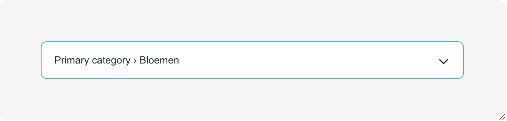
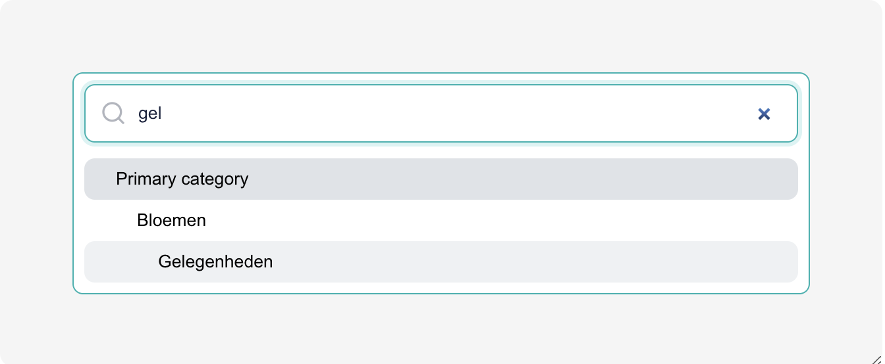

# Commercetools Category Field Plugin

This plugin provides a field for selecting a category from a commercetools project.
To make this work you need to fill in 3 CT options:

| Option         | Description                             |
| -------------- | --------------------------------------- |
| `projectKey`   | The commercetools project key           |
| `clientId`     | A commercetools API client id           |
| `clientSecret` | A commercetools API client secret       |
| `ancestorKey`  | A commercetools category key (optional) |

The `clientId` and `clientSecret` should be for a token that has **only** the
`view_categories` scope.

The `ancestorKey` is optional and can be used to filter the categories by a specific
ancestor. If no `ancestorKey` is set, all categories will be fetched.

## Preview

<div style="display:flex;gap:1rem;align-items:flex-start">
  
  
</div>

## Development

Install dependencies

```shell
pnpm install
```

Run the application locally with

```shell
pnpm dev
```

and open the [Sandbox](https://plugin-sandbox.storyblok.com/field-plugin/).

Then fill in the 3 options as described above.

## Deployment

To deploy, simply push to main.
