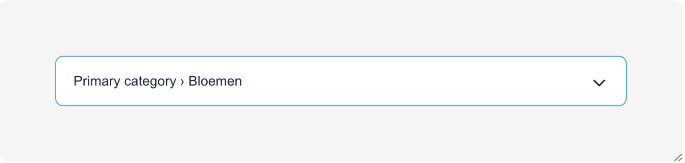
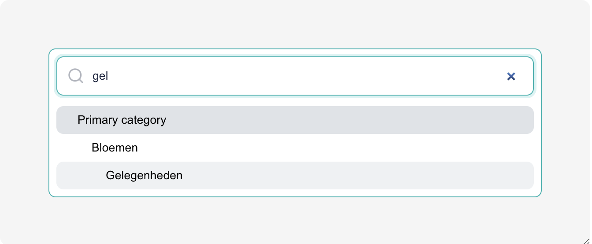

# Commercetools Category Field Plugin

This plugin provides a field for selecting a category from a commercetools project.
To make this work you need to fill in 3 CT options:

- projectKey: The commercetools project key
- clientId: A commercetools API client id
- clientSecret: A commercetools API client secret

The clientId and clientSecret should be for a token that has at least a category read scope.

## Preview

<div style="display:flex;gap:1rem;align-items:flex-start">


</div>

## Development

For development, run the application locally with

```shell
npm run dev
```

and open the [Sandbox](https://plugin-sandbox.storyblok.com/field-plugin/).

## Deployment

To build the project, run

```shell
npm run build
```

Deploy the field plugin with the CLI. Issue a [personal access token](https://app.storyblok.com/#/me/account?tab=token), rename `.env.local.example` to `.env.example`, open the file, set the value `STORYBLOK_PERSONAL_ACCESS_TOKEN`, and run

```shell
npm run deploy
```
